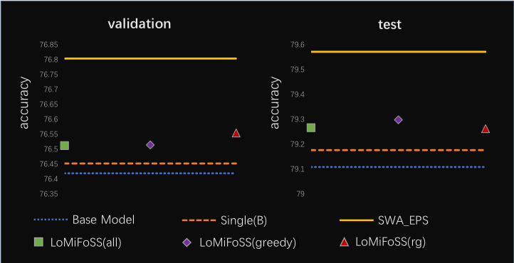

# LoMiFoSS-FEDL
This is an instance implementation for the concept proposed in [LoMiFoSS-FEDL](https://www.sciencedirect.com/science/article/abs/pii/S003132032030385X), which argues that local minima found in the subparameter sapce can be effective for ensembles of deep convolutional neural networks (DCNNs). This instance implementation is a simpler version compared with the instance implementation presented in [LoMiFoSS-FEDL](https://www.sciencedirect.com/science/article/abs/pii/S003132032030385X). This difference is that we employed [SWA](https://arxiv.org/abs/1803.05407) to find multiple extra base learners and integrate them in the subparameter space of a DCNN.

## classifier

This code is modified from [swa_gaussian](https://github.com/wjmaddox/swa_gaussian)

### dataset

We use imagenet to eval our work

In order to evaluate the generalization of ensemble model,  we resplit imagenet to train data, val data and test data.

| split dataset | Part                      | File                            |
| ------------- | ------------------------- | ------------------------------- |
| Train         | 0.95 * origin train split | dataset/imagenet/train_0.95.txt |
| Val           | origin val split          | dataset/imagenet/val_list.txt   |
| Test          | 0.05 * origin train split | dataset/imagenet/train_0.05.txt |

### scripts

#### imagenet retrain process
use resnet50 to retrain imagenet, scripts contains train and eval process
```
bash scripts/imagnet_resnet_retrain.sh
```

####  swa in entire paramet space

use resnet50 retrain base model to ensemble, scripts contains train and eval process

```
bash scripts/imagnet_resnet_ensemble_index0.sh
```

#### LoMiFoSS-EDL in fc space

use resnet50 retrain base model to ensemble, 

1. scripts contains train, eval and extract result process

```
bash scripts/imagnet_resnet_ensemble_index4.sh
```

2. ensemble 

   in paper we use ensemble_mode="greedy_brute_force" and ensemble_mode=="random_greedy_v2"

```
bash scripts/greedy_ensemble.sh # provide 7 methods to ensemble

# ensemble_mode provided
# greedy: 
ensemble ckpt one by one from best val acc to worst val acc, if result is better, then reserve ckpt, otherwise throw away ckpt.
# random_greedy:   
do random greedy ckpt experiment random_times, each experiment contains experi_times ensemble behaviors, each ensemble behavior ensemble better result with ckpt put_back or not.
# greedy_brute_force:
ensemble ckpt one by one from best val acc to worst val acc, if result is better, then reserve ckpt, otherwise stop. 
# random_greedy_v2:
do random greedy ckpt experiment random_times, each experiment contains ckpt_nums times ensemble,  if result is better, then reserve ckpt, otherwise throw away ckpt.
# swa_all_ensemble:
do swa style(acutaully weighted ensebmle) all ckpt ensemble
# avg_step_all_ensemble: 
ensemble all ckpts by order, but averging ckpt weights each time.
# select:
do select ckpts ensmble by order ,defualt use averging  ckpt weights each time
```

   

### result



​	LoMiFoSS: local minima found in the sub-parameter space. 

​	all: all model are selected for ensemble. 

​	greedy: greedy brute force. 

​	rg: random greedy. 

​	SWA_EPS: swa in entire parameter space.

​	Single(B): The one of multiple models (including base model) that performs the best on the validation data set.
